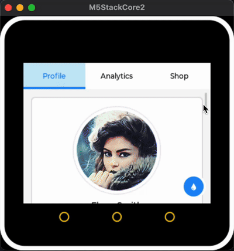
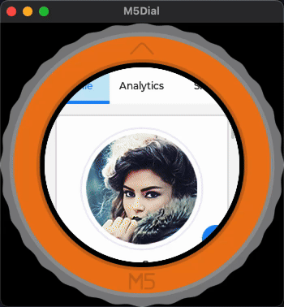
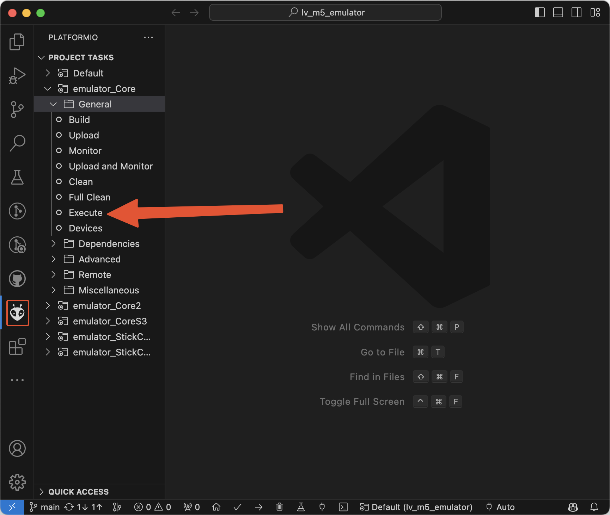

# Running the M5Stack LVGL device emulator via PlatformIO

Now it is more convenient to design [LVGL](https://github.com/lvgl/lvgl) UI on PC, 
which can reduce the time wasted in flash the firmware.
Using [M5GFX](https://github.com/m5stack/M5GFX), we can ensure that the display
effect on the PC side is consistent with that of the device.
Now we have also added a picture of the device shell as the border background, 
which can better simulate the display effect on the device side.

<div align=center>

</div>

## How to install & use demo

### Install Visual Studio Code

https://code.visualstudio.com/ - follow instructions there, if you don't have
vscode yet.


### Install SDL drivers

**Linux (Ubuntu, Debian, ...)**

Use one of options below:

```sh
# 64 bits
sudo apt-get install libsdl2-dev
```

```sh
# 32 bits
sudo apt-get install gcc-multilib g++-multilib libsdl2-dev:i386
```

Note:

- Use 32-bits build for more correct memory stat info.
- If you have conflicts on `libsdl2-dev:i386` install, remove 64-bits version
  and dependencies first.

**macOS**

Use [Homebrew](https://brew.sh/):

```sh
brew install sdl2 pkg-config
```

Note: 
On macOS you need to include (uncomment in provided example [platformio.ini](./platformio.ini) file) these lines in your platformio.ini file to import the drivers: 
```
  ; SDL2 includes
  !pkg-config --cflags SDL2
  !pkg-config --libs SDL2
```
If your Mac has Mx chip (arm64 architecture), you also need to include (uncomment) this line in your platformio.ini file: 
```
  ; -arch arm64
```

**Windows**

Use [MSYS2](https://www.msys2.org/)

```sh
pacman -S mingw-w64-x86_64-gcc mingw-w64-x86_64-SDL2
```

Add the path to your Mingw-w64 `bin` folder to the Windows PATH environment
variable (usually `C:\msys64\mingw64\bin`). See [instruction, 4](https://code.visualstudio.com/docs/cpp/config-mingw#_prerequisites).


### Install flasher drivers (optional)

If you plan to upload firmware & debug hardware, read notes in PlatformIO
[install docs](http://docs.platformio.org/en/latest/installation.html#troubleshooting).


### Choose LVGL version(V8 or V9)

If you want build with lvgl v8, this was default option, you don't need change any files!
But if you want try the lvgl  latest version v9, you need to modify the version control macro definition in [platformio.ini](./platformio.ini) file as:
```
  -D LVGL_USE_V8=0  ; lvgl v8
  -D LVGL_USE_V9=1  ; lvgl v9
```
And don't forget to modify the links of the dependent libs to this:
```
  ; lvgl=https://github.com/lvgl/lvgl/archive/refs/tags/v8.3.0.zip  ; lvgl v8
  lvgl=https://github.com/lvgl/lvgl#master                          ; lvgl v9
```

### Build/Run

1. Clone this repository or download as zip.
2. In vscode, open folder via `File` -> `Open Folder...` menu.
   - If you do it first time - agree, when it suggests to install PlatformIO
     plugin, and wait when PlatformIO then install build tools and package
     dependencies.

To build/execute, on PlafomIO tab expand desired env and click target:



Note, for emulator env `upload` also executes compiled binary.

### Zoom and rotate the window at runtime

The emulator support zoom and rotate the window at runtime. So you can easily zoom and rotate the window to view UI details.

1. Zoom

    Press :keyboard: **1 ~ 6** number key to zoom the window size.

1. Rotate

    Press :keyboard: **"L"** **"R"** letter key to rotate the window.

## Tab5 Board – Key Notes

1. **Adjust `LV_MEM_SIZE` when needed**  
   The default LVGL heap may be insufficient for complex screens. Increase this value to prevent allocation failures.

2. **Increase the `lvgl_rtos_task` stack size**  
   LVGL tasks can overflow the default stack. Allocate a larger stack to ensure GUI stability.

3. **Fine-tune `LV_BUFFER_LINE` for faster rendering**  
   A larger draw buffer (more lines) reduces flush operations and improves drawing speed.